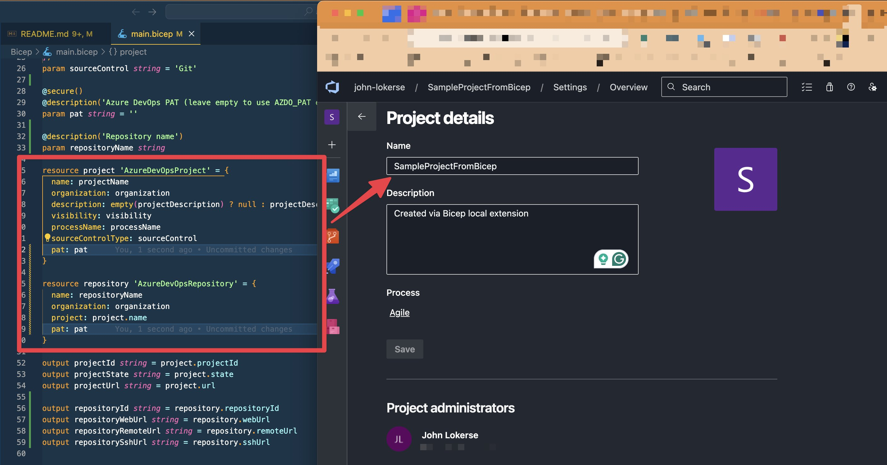

# Azure DevOps Bicep Local Extension (Experimental)

This project demonstrates a custom Bicep Local Extension that can create Azure DevOps configuration via the Azure DevOps REST API using Bicep.



> [!NOTE]
> This is an experimental Bicep feature and is subject to change. Do not use it in production.

## Current Capabilities

Experimental / sample only. Limited functionality for now:

- **Create** Azure DevOps Project
- **Create** Azure DevOps Repos
- **Create** Azure DevOps Artifact Feeds
- **Create** Federated Service Connections
- **Assign** Entra ID groups to Azure DevOps Project Permissions
- **Install** Azure DevOps Marketplace Extensions
- **Create** Azure DevOps Work Items
- **Trigger** Azure Pipelines

See the [Sample](./Sample/main.bicep) folder for an example Bicep template.

## Prerequisites

- .NET 9 SDK
- Bicep CLI v0.37.4+ (for `local-deploy`)

## How to use it locally or via the GitHub Container Registry

Here are the steps to run it either locally or using the GitHub Container Registry.

### Local build

Run script `Publish-Extension.ps1` from the folder [Infra/Scripts/](./Infra/Scripts/) to publish the project and to publish the extension locally for Bicep to use:

```powershell
./Infra/Scripts/Publish-Extension.ps1 -Target ./azure-devops-extension
```

This creates the binary that contains the Azure DevOps API calls. Prepare your `bicepconfig.json` to refer to the binary. Set `experimentalFeaturesEnabled` -> `localDeploy` to `true` and refer the extension `azuredevops` to the binary:

```json
{
  "experimentalFeaturesEnabled": {
    "localDeploy": true
  },
  "extensions": {
    "azuredevops": "<path-to-binary>/azure-devops-extension" // local
  },
  "implicitExtensions": []
}
```

Run `bicep local-deploy main.bicepparam` to test the extension locally. Also, see the example in the [Sample](./Sample/) folder.

### GitHub Container Registry

Every push to `main` publishes the extension to the GitHub Container Registry (ghcr.io) via the [Publish Extension](./.github/workflows/publish.yml) workflow. The version is determined by [Nerdbank.GitVersioning](./version.json).

In the `bicepconfig.json` you refer to the registry:

```json
{
  "experimentalFeaturesEnabled": {
    "localDeploy": true,
    "ociEnabled": true
  },
  "extensions": {
    "azuredevops": "br:ghcr.io/johnlokerse/azure-devops-bicep-local-deploy:<version>" // GitHub Container Registry
  },
  "implicitExtensions": []
}
```

Available versions are listed under the repository's [packages](https://github.com/johnlokerse/azure-devops-bicep-local-deploy/pkgs/container/azure-devops-bicep-local-deploy).

If you want to publish to your own registry, fork the project and run the GitHub Actions, or log in to ghcr.io (for example with `docker login ghcr.io`) and push it yourself:

```powershell
[string] $target = "br:ghcr.io/<owner>/<repository>:<version>"

./Infra/Scripts/Publish-Extension.ps1 -Target $target
```

> [!NOTE]
> Packages published to ghcr.io are private by default. Change the package visibility to public in the package settings to allow anonymous pulls.

## Bicep Usage Example

```bicep
targetScope = 'local'
extension azuredevops

param organization string
param projectName string
param pat string
param repositoryName string

resource project 'AzureDevOpsProject' = {
  name: projectName
  organization: organization
  pat: pat
}

resource repository 'AzureDevOpsRepository' = {
  name: repositoryName
  organization: organization
  project: project.name
  pat: pat
}

output id string = project.projectId
```

## Azure DevOps authentication

This extension supports two authentication methods for Azure DevOps:

| Type                         | Description                                                                                                                                            | Other                                                                                                                                         |
|------------------------------|--------------------------------------------------------------------------------------------------------------------------------------------------------|-----------------------------------------------------------------------------------------------------------------------------------------------|
| Personal Access Token (PAT)  | A PAT is a token that you can use to authenticate with Azure DevOps. It is less secure than Azure Entra access tokens and should be used with caution. | Consider using Azure Entra tokens instead.                                                                                                    |
| Workload Identity Federation | Azure Entra access tokens are more secure and should be preferred over PATs. They can be obtained using Azure Entra ID authentication.                 | When using this local-deploy feature in an Azure Pipeline, make sure the service principal used has the required permissions in Azure DevOps. |

## Testing

Run the unit tests with:

```powershell
dotnet test
```

For detailed output:

```powershell
dotnet test --logger "console;verbosity=detailed"
```

## Contributing

Want to contribute? Check out the [CONTRIBUTING.md][00] for more information.

## Disclaimer

Sample only – not an official Microsoft supported extension. Use at your own risk.

<!-- Link reference definitions -->
[00]: CONTRIBUTING.md
